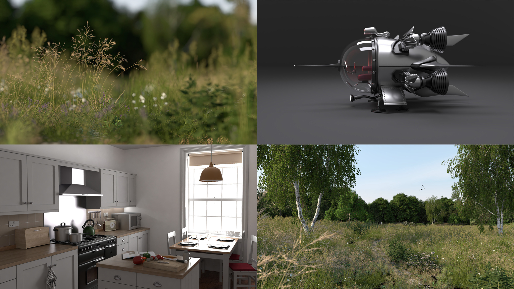

# Toyray

[](https://travis-ci.org/111116/toyray)

a naive path tracer.



See `gallery` for scene credits.

## Compile and Run

```bash
mkdir build
cd build
cmake ..
make -j
./toyray
```

## Implemented functions

#### shape types:

- triangle
- triangle mesh
- sphere
- infinite plane
- square
- cube
- transformed geometries
- alpha-masked geometries
- bump-mapped geometries

#### materials:

- lambert reflective
- lambert transmissive
- mirror
- conductor (smooth / rough)
- dielectric (smooth)
- plastic (smooth / rough)

#### light types:

- diffuse area light
- point light
- directional light
- constant environment light
- environment map (light probe)

#### samplers

- std::mt19937

#### input format:

- shapes: Wavefront OBJ (ASCII)
- scene configuration: Tungsten styled JSON
- light probe / texture: EXR, HDR, PNG, JPG

#### output format:

- EXR
- BMP

## Other notes

This renderer is neither reliable or efficient. If you are looking for open-source renderers, check out Mitsuba, PBRT, Tungsten...

If you decide to learn path tracing by reading this code, I recommend start by looking at the path tracing core `src/renderer.cpp`.

Scenes are available at [toyray-scenes](https://github.com/111116/toyray-scenes) made by other artists, mostly converted by [Benedikt Bitterli](https://benedikt-bitterli.me/).

